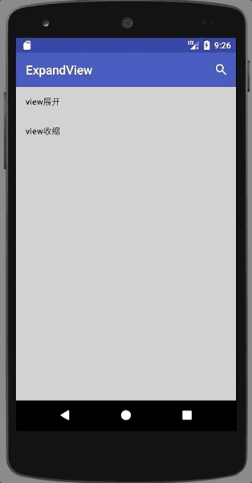
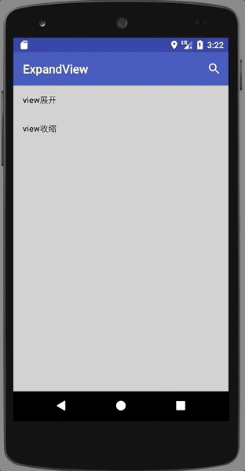

# ExpandView
可以扩展和收缩的父view

# 效果图




第二张gif图片说明，其中这个搜索布局是我借用的别人的，本人比较懒，直接拿来用了

布局出处：[http://www.jianshu.com/p/e0a6fc621945](http://www.jianshu.com/p/e0a6fc621945)

### 如果你是AndroidStudio用户,在build.gradle中添加

```
compile 'com.cool:expandview:1.0.1'
```

### 使用
### 1.1 自定义属性
|    属性     | 属性说明    |
| --------   | -----:   |
| anim_orientation        | 动画开始执行的方向     |
| anim_duration        | 动画时长      |
| centerX        |动画开始圆心x      |
| centerY        | 动画开始圆心y      |

anim_orientation属性说明：

|    属性     | 属性说明    |
| --------   | -----:   |
| upleft        | 动画从左上方开始扩散     |
| upright        | 动画从右上方开始扩散      |
| leftbottom        |动画从左下方开始扩散     |
| rightbottom        | 动画从右下方开始扩散      |
| center        | 动画从中心开始扩散      |

布局中
    
```
  <com.cool.expandviewlibrary.ExpandView
            android:id="@+id/ev_img"
            android:layout_width="wrap_content"
            android:layout_height="wrap_content"
            android:layout_gravity="center_horizontal"
            android:layout_marginTop="10dp"
            android:visibility="invisible"
            app:anim_orientation="center"
            app:anim_duration="500">

            <ImageView
                android:layout_width="350dp"
                android:layout_height="350dp"
                android:scaleType="centerCrop"
                android:src="@mipmap/meizi2" />
        </com.cool.expandviewlibrary.ExpandView>
```
### 1.2 使用地方
```
ExpandView  = mImgExpandView = (ExpandView) findViewById(R.id.ev_img);

mImgExpandView.doExpandAnim();//展开动画

mImgExpandView.doPackupAnim();//收缩动画
```
### 1.3 使用说明：
* ExpandView只能有一个`子view`
* 如果需要作展开动画，请将ExpandView设置为invisible,设置为gone是没有效果的

简书博客地址：[http://www.jianshu.com/p/b5c1d35849ed](http://www.jianshu.com/p/b5c1d35849ed)

csdn博客地址 [http://blog.csdn.net/cool_fuwei/article/details/76832680](http://blog.csdn.net/cool_fuwei/article/details/76832680)